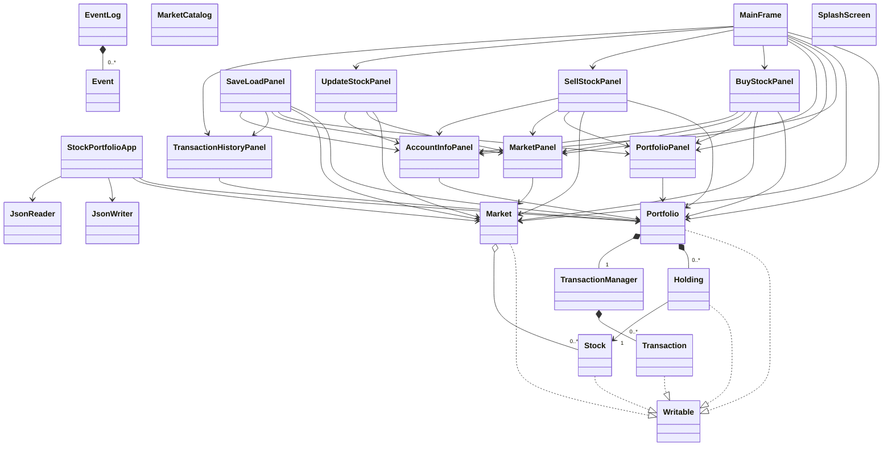

```mermaid
classDiagram
    class Event
    class EventLog

    class Holding
    class Market
    class Portfolio
    class Stock
    class Transaction
    class TransactionManager
    class MarketCatalog

    class Writable
    class JsonReader
    class JsonWriter

    class StockPortfolioApp
    class MainFrame
    class SplashScreen
    class AccountInfoPanel
    class BuyStockPanel
    class MarketPanel
    class PortfolioPanel
    class SaveLoadPanel
    class SellStockPanel
    class TransactionHistoryPanel
    class UpdateStockPanel

    EventLog *-- "0..*" Event

    Portfolio ..|> Writable
    Stock ..|> Writable
    Holding ..|> Writable
    Market ..|> Writable
    Transaction ..|> Writable

    Holding --> "1" Stock
    Market o-- "0..*" Stock
    Portfolio *-- "0..*" Holding
    Portfolio *-- "1" TransactionManager
    TransactionManager *-- "0..*" Transaction
    
    StockPortfolioApp --> Portfolio
    StockPortfolioApp --> Market
    StockPortfolioApp --> JsonWriter
    StockPortfolioApp --> JsonReader
    MainFrame --> Portfolio
    MainFrame --> Market
    MainFrame --> AccountInfoPanel
    MainFrame --> PortfolioPanel
    MainFrame --> MarketPanel
    MainFrame --> BuyStockPanel
    MainFrame --> SellStockPanel
    MainFrame --> UpdateStockPanel
    MainFrame --> TransactionHistoryPanel
    AccountInfoPanel --> Portfolio
    BuyStockPanel --> Portfolio
    BuyStockPanel --> Market
    BuyStockPanel --> PortfolioPanel
    BuyStockPanel --> MarketPanel
    BuyStockPanel --> AccountInfoPanel
    MarketPanel --> Market
    PortfolioPanel --> Portfolio
    SaveLoadPanel --> Portfolio
    SaveLoadPanel --> Market
    SaveLoadPanel --> PortfolioPanel
    SaveLoadPanel --> MarketPanel
    SaveLoadPanel --> TransactionHistoryPanel
    SaveLoadPanel --> AccountInfoPanel
    SellStockPanel --> Portfolio
    SellStockPanel --> Market
    SellStockPanel --> PortfolioPanel
    SellStockPanel --> MarketPanel
    SellStockPanel --> AccountInfoPanel
    TransactionHistoryPanel --> Portfolio
    UpdateStockPanel --> Market
    UpdateStockPanel --> MarketPanel
    UpdateStockPanel --> AccountInfoPanel
```
